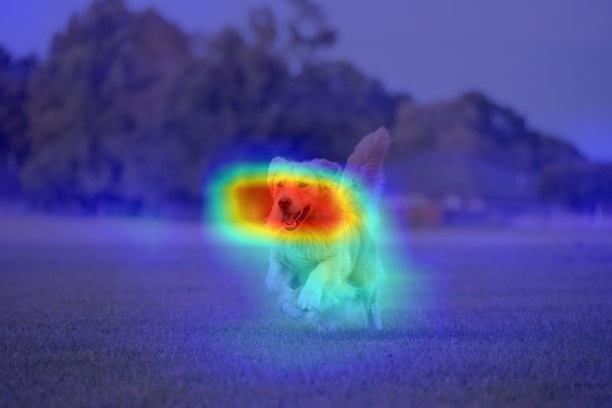
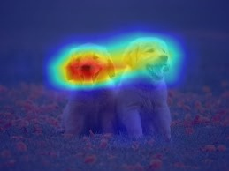
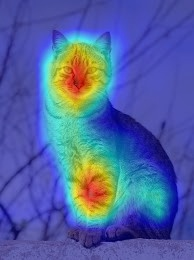

Automatic Grad-CAM for TensorFlow / Keras Models

A simple way to generate Grad-CAM heatmaps for TensorFlow/Keras models.

GradHeatmap automatically adapts to:

Binary classification models (sigmoid)

Multi-class classification models (softmax)

Transfer learning models with pretrained backbones

Fully custom CNN architectures

Models with internal Rescaling layers

Models requiring backbone-specific preprocessing

No manual layer selection.
No hardcoded preprocessing.
No architecture rewriting.

✨ Key Features

🔍 Automatic Backbone Detection
Detects nested pretrained models (ResNet, MobileNet, EfficientNet, etc.) using parameter heuristics.

🧠 Automatic Last Convolution Layer Detection
Traverses model structure to locate the correct convolution layer.

⚖️ Binary & Multi-Class Support
Handles:

(None, 1) sigmoid outputs

(None, N) softmax outputs

⚙️ Smart Preprocessing Logic

Uses correct preprocess_input for detected backbone

Detects internal tf.keras.layers.Rescaling

Falls back to safe [0, 1] normalization

🎨 Heatmap Overlay

OpenCV colormap (JET)

Alpha blending

Safe normalization

Output validation

🧩 Works With:

VGG16 / VGG19

ResNet / ResNetV2

MobileNet / MobileNetV2 / V3

EfficientNet / EfficientNetV2

DenseNet

Inception / InceptionResNet

Xception

NASNet

ConvNeXt

RegNet

Custom CNNs

🚀 Installation
## Installation

Install directly from GitHub:

bash
pip install git+https://github.com/AhmedAbdAlKareem1/gradheatmap-tf.git

⚡ Quick Start
from gradheatmap import HeatMap

model_path = "your_model"
image_path = "your_img_path"

#class_names Can be mulit class ['cat','dog','rabbit']

class_names = ["cat", "dog"]

heat = HeatMap(
    model=model_path,
    img_path=image_path,
    class_names=class_names
)

overlay = heat.overlay_heatmap()

heat.save_heat_img("result.jpg", overlay)

Output:
heatmap/
└── result.jpg

  
  
  

    terminal OutPut 
    
Detected Model : vgg16

Image Size = (224, 224)

Using vgg16 specific preprocessing.

Layer Name : block5_conv3

Class: 0 Cat  Confidence: 100.00%

Successfully saved heatmap to: heatmap\heatmap.jpg

🧠 How It Works

Loads model with compile=False to avoid custom loss conflicts.

Detects backbone submodel (if exists).

Locates last convolution layer.

Builds gradient model dynamically.

Computes gradients of target class score.

Applies channel-wise importance weighting.

Generates normalized heatmap.

Blends heatmap over original image.

🛡 Design Philosophy

GradHeatmap was built to:

Avoid hardcoded layer names.

Avoid manual architecture inspection.

Avoid preprocessing mistakes.

Work reliably across multiple CNN families.

It is designed to be model-agnostic.

⚠️ Requirements

tensorflow>=2.10

numpy<2

opencv-python>=4.7

Model must contain at least one Conv2D or DepthwiseConv2D layer.

## 📄 License

This project is licensed under the MIT License - see the LICENSE file for details.

